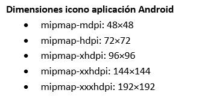

# Icono Personal

El estudiante deberá crear un icono personalizado para todas sus aplicaciones Android, considerando lo siguiente:

* Debe ser único de cada estudiante.
* Ser creativo en el diseño.
* Debe incluir la versión cuadrada y la versión circular.
* No debe poseer elementos visuales que dañen la integridad de una persona o la integridad de la iglesia y el cristianismo.
* No debe poseer símbolos prohibidos o denigrantes.
* Debe incluir los diseños de todas las dimensiones requeridas por Android.

El estudiante deberá subir un archivo comprimido con el diseño en todos los diferentes tamaños.
